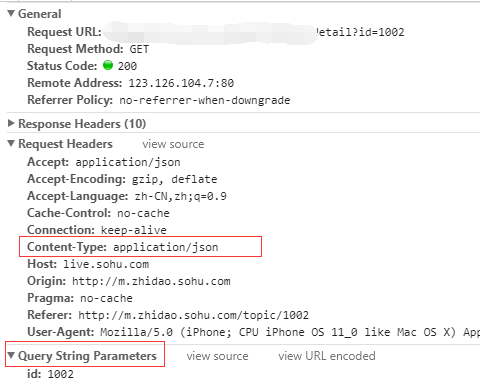
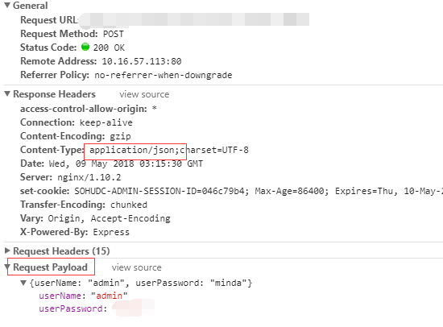
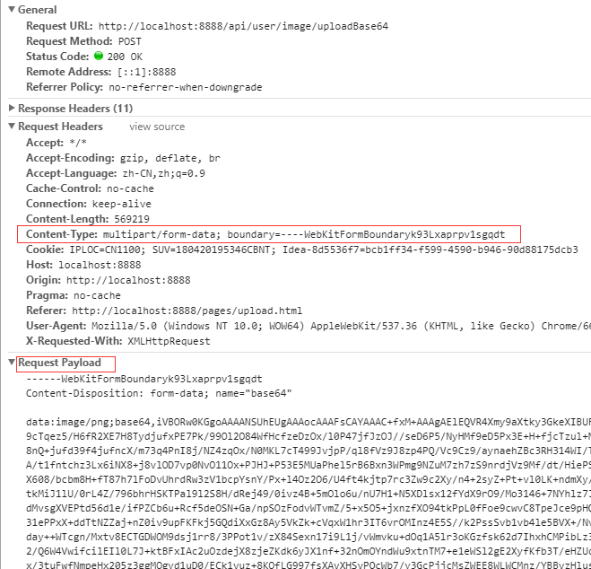
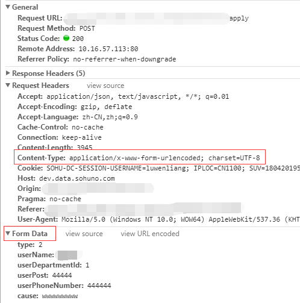

# http参数

> 前因是这样的，之前一直使用jq的ajxa请求接口。新项目使用react加axios之后接口请求一直出现错误。做一番总结🤓

## 一. http参数介绍
http请求参数有Query String Parameters、Form Data、Request Payload。

### 1.Query String Parameters
GET请求时，参数会以url string的形式进行传递。即?后的字符串则为其请求参数，并以&作为分隔符。

如下http请求报头：
```
// General
Request URL: http://baidu.com?x=1&y=2
Request Method: GET

// Query String Parameters
   x=1&y=2

```



### 2.Request Payload
当发起一次POST请求时，若content-type为application/json，则参数会以Request Payload的形式进行传递（显然的，数据格式为JSON），不会显式出现在请求url中。

如下http请求报头：
```
// General 
Request URL: http://foo.com 
Request Method: POST 
// Request Headers 
content-type: application/json; charset=UTF-8 

// Request Payload 
x=1&y=2
```


> 有时候我们需要使用古老的form表单的方式提交文件图片等，在js中有formData类可以达成form表单的形式提交。

如下图
其中，WebKitFormBoundaryk93Lxaprpv1sgqdt为浏览器随机生成的boundary，作为分隔参数，作用等同于&。



### Form Data
当发起一次POST请求时，若未指定content-type，则默认content-type为application/x-www-form-urlencoded。即参数会以Form Data的形式进行传递，不会显式出现在请求url中。

如下图：



## 二. axios的问题
> 首先axios post方法默认使用application/json格式编码数据，ajax默认使用application/x-www-form-urlencoded

### application/json与application/x-www-form-urlencoded
application/x-www-form-urlencoded上传到后台的数据是以key-value形式进行组织的，而application/json则直接是个json字符串。如果在处理application/json时后台还是采用对付application/x-www-form-urlencoded的方式将会产生问题。例如后台node.js依然采用之前对付application/x-www-form-urlencoded的方法，那么，这个时候再querystring.parse(decodeURIComponent(data)).key只能获取到undefined。

### axios解决方案
第一种：前端使用qs插件， 参考axios官方文档[https://github.com/axios/axios#using-applicationx-www-form-urlencoded-format]

第二种：后台更改

出现这种情况的原因是 因为axios post一个对象到后端的时候，是直接把json放到请求体中的，提交到后端的，而后端是怎么取参数的，是用的

```
@RequestParam

```

这个是什么意思，这个是只能从请求的地址中取出参数，也就是只能从username=admin&password=admin这种字符串中解析出参数，这样是不能提取出请求体中的参数的。
那么现在我们又可以大胆的猜想了，如果我们不这么去取参数，而是直接去请求体中取参数不就行了么。
我们可以不改前端，只需要改改后端代码就可以了。

```
@RequestMappting("/api/doLogin")
@ResponseBody
public Object doLogin(@RequestBody Map map) throws Exception {
  System.out.println("username: "+map.get("username"));
  System.out.println("password: "+map.get("password"));
  JSONObject json = new JSONObject();
  json.put("success", true);
  return json;
}

```
通过@RequestBody 注解，springmvc可以把json中的数据绑定到Map中， 我们就可以取出了.


## 参考

[https://blog.csdn.net/wopelo/article/details/78783442]

[https://www.jianshu.com/p/042632dec9fb]